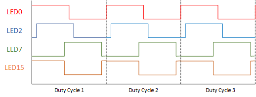

# PCA9685

Library for using PCA9685 - 16-channel, 12-bit PWM Fm+ I2C-bus LED controller
See PCA9685.pdf datasheet for chip details

## Remarks

Author: Thomas Oppenhoff  
License: GNU Public License

## Class PCA9685

Encapsulates all communication with PCA9685 IC

### Constructors

#### PCA9685()

Initializes a new instance of the PCA9685 IC with  
- default I2C address (A0 - A5 connected to ground)  
- default driver mode of direct motor drive
- default PWM cylce frequency of ~200Hz (PRE_SCALE at 1Eh at 25MHz internal clock)  

#### PCA9685(uint8_t i2cSlaveAdr)

Initializes a new instance of the PCA9685 IC with  
- the specified I2C address (only the values of pulled up A0 - A5 pins are needed)  
- default driver mode of direct motor drive
- default PWM cycle frequency of ~200Hz (PRE_SCALE at 1Eh at 25MHz internal clock)  

#### PCA9685(uint8_t i2cSlaveAdr, uint8_t driveMode);

Initializes a new instance of the PCA9685 IC with  
- the specified I2C address (only the values of pulled up A0 - A5 pins are needed)  
- the specified driver mode
- default PWM cycle frequency of ~200Hz (PRE_SCALE at 1Eh at 25MHz internal clock)  

#### PCA9685(uint8_t i2cSlaveAdr, uint8_t driveMode, float frequency);

Initializes a new instance of the PCA9685 IC with  
- the specified I2C address (only the values of pulled up A0 - A5 pins are needed)  
- the specified driver mode
- the specified PWM cycle frequency (IC limitation around 23Hz - 1500Hz, please see defines)  

### Methods

#### Led& getLed(uint8_t pin)

Gets a single LED  in order to let you modify or read it.

#### float getFrequency() const

Gets the frequency at which the chip's PWM cycle is operating.

#### void setFrequency(float frequency)

Sets the frequency at which the chip's PWM cycle should be operating.

**Call setup() for changes to take effect**

#### uint8_t getPreScale() const

Gets the pre scale value, which indicates the frequency at which the IC's PWM cycle is operating.  
(IC's internal implementation)

PreScale = (Clock Speed / (4096 * frequency)) - 1

#### void setPreScale(uint8_t preScale);

Sets the pre scale value, which indicates the frequency at which the IC's PWM cycle is operating.  
(IC's internal implementation)

PreScale = (Clock Speed / (4096 * frequency)) - 1

**Call setup() for changes to take effect**

#### uint8_t getDriveMode() const

Gets the driver mode of the chip.

#### void setDriveMode(uint8_t driveMode);

Sets the driver mode of the chip.

**Call setup() for changes to take effect**

#### void setup() const

Initializes the PCA9685 chip with your settings for frequency and driver mode. This method can be called everytime you want to change your setup. No need to restart the chip for frequency or driver mode changes.

#### void writeAllPinss() const

Writes all output values of all PWM output pins to the PCA9685 IC

## Class PCA9685::PWMOutputPin

Encapsulates a single PWM output pin on the PCA9685 IC

### Methods

#### void write() const

Writes the value of this object to the PWM output pin on PCA9685 using the I2C protocol

#### uint16_t getValue()

Returns the value of this object  

#### void setValue(uint16_t value)

Changes the value of this object.  
**Does not automatically update the value on the IC as well! Use setValueAndWrite(uint16_t) instead**

#### void setValueAndWrite(uint16_t value)

Changes the value of this object and updates the PWM output pin on PCA9685

#### void fullOn()

Sets the value of this object to be fully on

#### void fullOnAndWrite();

Sets the value of this object to be fully on and updates the PWM output pin on PCA9685

#### void fullOff()

Sets the value of this object to be fully off

#### void fullOffAndWrite()

Sets the value of this object to be fully off and updates the PWM output pin on PCA9685

## Driver Modes

The driver mode simplifies the different operational features of the PCA9685 IC and helps you with selecting invert and pull-down for the output. Please look at the schematics below and select the one mode you want to use.

### PCA9685_MODE_MOTOR_DIRECT
**Default mode of PCA9685**  
Use this mode when you are directly driving small 5V dc motors (less than 25mA drain)

### PCA9685_MODE_LED_DIRECT
Use this mode when you are directly driving single LEDs (less than 25mA drain)  
The Chipset's invert feature will be used

### PCA9685_MODE_N_DRIVER
Use this mode when you are driving N-Type MOSFETs    
The Chipset's internal pull-down resistor will be used

### PCA9685_MODE_P_DRIVER
Use this mode when you are driving P-Type MOSFETs    
The Chipset's invert feature will be used  
The Chipset's internal pull-down resistor will be used  

## Load distribution

In order to keep the load on the IC as low as possible the raise to a high signal will happen for each pin at a different time on the duty cycle in this implementation. Each pin is seperated by at least 1/16 of the duty cycle length from the next raised signal.

This image shows the load distribution for the pins LED0, LED2, LED7 and LED15 at 50% PWM (2048 value). All those are high at 50%  of the time of a duty cycle, but notice that no pin changes from low to high at the same point on the duty cycle.

## Defines

Define | Description
------ | -------------
PCA9685_SERIAL_DEBUG | Activate this define in PCA9685.h on line 17 to get detailed debugging info written to Serial
PCA9685_NUM_PINS | Number of PWM pins on PCA9685
PCA9685_MAX_VALUE | Max possible PWM value for a single pin
PCA9685_FULL_ON | PWM value for fully on
PCA9685_FULL_OFF | PWM value for fully off
PCA9685_MIN_FREQUENCY | Min possible PWM cycle frequency 
PCA9685_MAX_FREQUENCY | Max possible PWM cycle frequency
PCA9685_LED*n* | Constants for each PWM pin

### Internal defines

You may not need those defines. They are mainly for internal usage.

Define | Description
------ | -------------
PCA9685_BASEADR | Base I2C address of PCA9685 when A0 - A5 are connected to ground
PCA9685_MODE1| Address of MODE1 register
PCA9685_MODE2 | Adress of MODE2 register
PCA9685_PRE_SCALE | Adress of PRE_SCALE register
PCA9685_LED0_ON_L | First register for reading/writing pin PWM states. All other registeres can be reached by either simple calculation of by using the chipset's autoincrement feature.
PCA9685_DEFAULT_PRE_SCALE | Chipset's own default value for the PRE_SCALE register
PCA9685_ADR_PINS | Bitmask for the address pins available
PCA9685_CLOCK | Speed of the internal clock
PCA9685_MODE1_SLEEP_BIT | Sleep bit in MODE1 register
PCA9685_LED_ON_FULL_ON_BIT | Led fully on bit in LEDn_ON register
PCA9685_LED_OFF_FULL_OFF_BIT | Led fully off bit in LEDn_OFF register
PCA9685_MODE2_INVRT_BIT | Invert output bit in MODE2 register
PCA9685_MODE2_OUTDRV_BIT | Output Driver bitin MODE2 register

