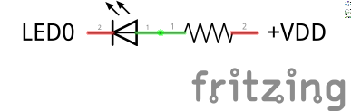
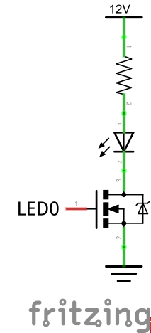
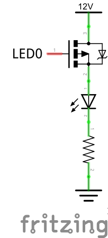

# PCA9685

Library for using PCA9685 - 16-channel, 12-bit PWM Fm+ I2C-bus LED controller
See PCA9685.pdf datasheet for chip details

## Remarks

Author: Thomas Oppenhoff  
License: GNU Public License

## Class PCA9685

Encapsulates all communication with PCA9685 chipset

### Constructors

#### PCA9685()

Initializes a new instance of the PCA9685 chip with  
- default I2C address (A0 - A5 connected to ground)  
- default frequency of ~200Hz (PRE_SCALE at 1Eh at 25MHz internal clock)  
- default driver mode of direct motor drive

#### PCA9685(uint8_t i2cSlaveAdr)

Initializes a new instance of the PCA9685 chip with  
- the specified I2C address (only the values of pulled up A0 - A5 pins are needed)  
- default frequency of ~200Hz (PRE_SCALE at 1Eh at 25MHz internal clock)  
- default driver mode of direct motor drive

#### PCA9685(uint8_t i2cSlaveAdr, float frequency)

Initializes a new instance of the PCA9685 chip with  
- the specified I2C address (only the values of pulled up A0 - A5 pins are needed)  
- the specified frequency (chipset limitation around 40Hz - 1000Hz)  
- default driver mode of direct motor drive

#### PCA9685(uint8_t i2cSlaveAdr, float frequency, uint8_t driveMode)

Initializes a new instance of the PCA9685 chip with  
- the specified I2C address (only the values of pulled up A0 - A5 pins are needed)  
- the specified frequency (chipset limitation around 40Hz - 1000Hz)  
- the specified driver mode

#### PCA9685(uint8_t i2cSlaveAdr, uint8_t driveMode)

Initializes a new instance of the PCA9685 chip with  
- the specified I2C address (only the values of pulled up A0 - A5 pins are needed)  
- default frequency of ~200Hz (PRE_SCALE at 1Eh at 25MHz internal clock)  
- the specified driver mode

### Methods

#### Led& getLed(uint8_t pin)

Gets a single Led in order to let you modify or read it.

#### void setup() const

Initializes the PCA9685 chip with your settings for frequency and driver mode

#### void readAllLeds()

Reads all output values from PCA9685 and updates all Led objects

#### void writeAllLeds() const

Writes all output values of all Leds to PCA9685

## Class PCA9685::Led

Encapsulates a single Led pin on PCA9685 chipset

### Constructors

#### Led(uint8_t idx, PCA9685* parent)

Initializes a new Led pin with the specified index (0 = LED0, 15 = LED15) and a default value of 0 (full off)  
Parent is a pointer to the parent PCA9685 chip. It is used to do operations on the pinn.

### Methods

#### void read()

Reads the value of this Led pin from PCA9685 and updates the value of this object

#### void write() const

Writes the value of this object to the Led pin on PCA9685

#### uint16_t getValue()

Returns the value of this object  

#### void setValue(uint16_t value)

Changes the value of this object.  
**Does not automatically update the value on the chip as well! write() needs to be called**

#### void fullOn()

Sets the value of this object to be fully on

#### void fullOff()

Sets the value of this object to be fully off

## Defines

#### PCA9685_BASEADR
Base I2C address of PCA9685 when A0 - A5 are connected to ground

#### PCA9685_MODE1
Address of MODE1 register

#### PCA9685_MODE2	
Adress of MODE2 register

#### PCA9685_PRE_SCALE
Adress of PRE_SCALE register
	
#### PCA9685_LED0_ON_L
First register for reading/writing pin PWM states  
All other registeres can be reached by either simple calculation of by using the chipset's autoincrement feature.

#### PCA9685_MODE_MOTOR_DIRECT
Default mode of PCA9685  
Use this mode when you are directly driving small 5V dc motors (less than 25mA drain)

#### PCA9685_MODE_LED_DIRECT
Use this mode when you are directly driving single LEDs (less than 25mA drain)  
The Chipset's invert feature will be used

#### PCA9685_MODE_N_DRIVER
Use this mode when you are driving N-Type MOSFETs    
The Chipset's internal pull-down resistor will be used

#### PCA9685_MODE_P_DRIVER
Use this mode when you are driving P-Type MOSFETs    
The Chipset's invert feature will be used  
The Chipset's internal pull-down resistor will be used  

#### PCA9685_NUM_PINS

Number of LED pins on PCA9685

#### PCA9685_MAX_VALUE

Upper bound for value of a single Led

#### PCA9685_FULL_ON

Value for a single Led to be fully on

#### PCA9685_FULL_OFF

Value for a single Led to be fully off

#### PCA9685_DEFAULT_PRE_SCALE

Chipset's own default value for the PRE_SCALE register

#### PCA9685_ADR_PINS

Bitmask for the address pins available

#### PCA9685_CLOCK

Speed of the internal clock

#### PCA9685_MIN_FREQUENCY

Min allowed frequency on chip

#### PCA9685_MAX_FREQUENCY

Max allowed frequency on chip

#### PCA9685_MODE1_SLEEP_BIT

Sleep bit in MODE1 register

#### PCA9685_LED_ON_FULL_ON_BIT

Led fully on bit in LEDn_ON register

#### PCA9685_LED_OFF_FULL_OFF_BIT

Led fully off bit in LEDn_OFF register

#### PCA9685_MODE2_INVRT_BIT

Invert output bit in MODE2 register

#### PCA9685_MODE2_OUTDRV_BIT

Output Driver bitin MODE2 register

#### PCA9685_LEDn

Defines for accessing Led objects by their pin names

