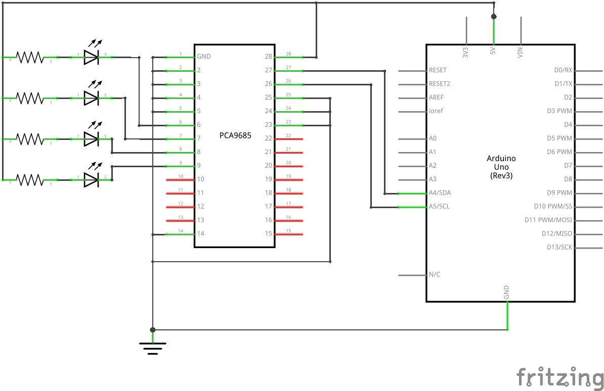
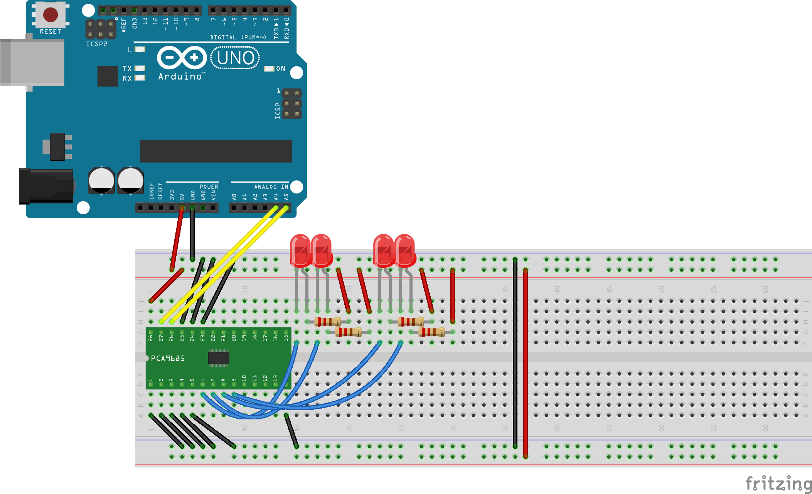

# PCA9685 Example

This example should help you getting started with PCA9685 and this library

## Purpose

This example will cycle 4 LEDs through various brightness levels

## Schematic

## Wiring

- Connect A0 - A5 (pins 1-5, 24) to ground  
- Connect VSS (pin 14) to ground  
- Connect EXTCLK (pin 25) to ground  
- Connect OE (pin 23) to ground
- Connect SDA (pin 27) to Arduino Uno A4 (other pin on other Arduino boards!)
- Connect SCL (pin 26) to Arduino Uno A5 (other pin on other Arduino boards!)
- Connect LED0 (pin 6) to catode of first LED
- Connect LED1 (pin 7) to catode of second LED
- Connect LED2 (pin 8) to catode of third LED
- Connect LED3 (pin 9) to catode of fourth LED
- Connect VDD (pin 28) to +5V
- Connect LEDs to +5V using the right current limiting resistor 

## Code

[PCA9685_example.ino](PCA9685_example.ino "PCA9685_example.ino")